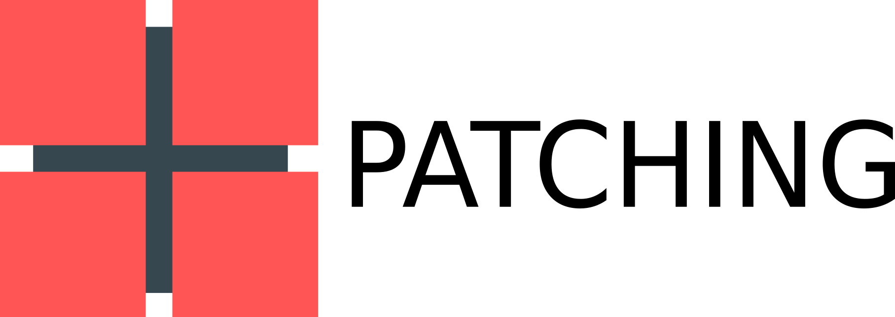
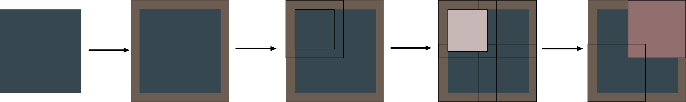
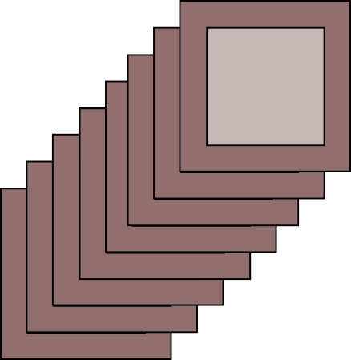
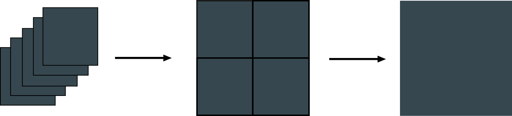
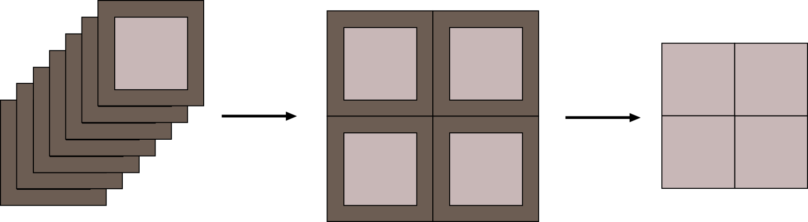
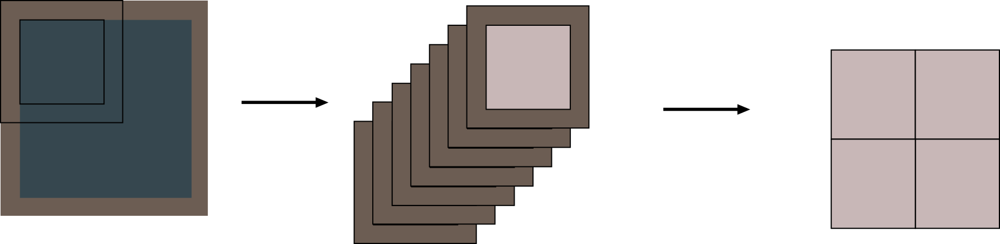

## Project Description 

Patching and Unpatching are a set of tools that are used for image processing. The patching tool is used to cut small square sections of the input image known as patches. The unpatching tool takes those patches and combines them back together to make the final image. 

## Installation 

```python
poetry build 
poetry install patching_unpatching-1.0-py3-none-any.whl
```
## To use 
```python
from patching_unpatching.patching_unpatching import patching_input, unpatching
```


## Patching Tool 




## Description 

- Patching is a tool that allows cutting an image into smaller square sections (patches). The tool takes an image as an input, it can also pad the image with reflective padding and then cut the overlapped patches from the image and gives output as an n-dimensional tensor of the patches. The input can be a single channel image or a three-channel image. 


## Usage Example

### Single-channel image

- The image shape passed should be in dimensions (channels, height, width), where the channel is 1 in this case

  ###  Example input 

  ```python
  patching_input(
      start_image=image_tensor,  # Tensor shape = channels, width, height
      patch_size=220,  # patch_size = edge length of the square patch
  )
  ```

- Image passed is image_tensor of dimension (1,1000,1000) - single channel, 1000 px : width , 1000 px : height

- Padding is calculated internally, the optimal padding comes out to be 10 px

- After reflective padding the dimensions becomes (1 , 1020 , 1020) - 1 : single channel , 1020 px : width , 1020 px : height 

- The image are cut into patches of dimension 220 px X 220 px with 10px overlapping on each side of patches 

- The final dimension of the output tensor is (1, 5, 5, 220, 220) - 1: channel of the passed image, 5: number of patches along the width of the padded image, 5: number of patches along the height of the padded image, 220: width of one patch, 220: height of one patch

### Three-channel image 

- The image shape passed should be in dimensions (channels, height, width), where the channel is 1 in this case

  ### Example input 

  ```python
  patching_input(
      start_image=image_tensor,  # Tensor shape = channels, width, height
      patch_size=220,  # patch_size = edge length of the square patch
  )
  ```

- Image passed is image_tensor of dimension (3,1000,1000) - three channel, 1000 px : width , 1000 px : height

- Padding is calculated internally, the optimal padding comes out to be 10 px

- After reflective padding the dimensions becomes (3 , 1020 , 1020) - 3 : three channel , 1020 px : width , 1020 px : height 

- The image are cut into patches of dimension 220 px X 220 px with 10px overlapping on each side of patches 

- The final dimension of the output tensor is (3, 5, 5, 220, 220) - 3: channel of the passed image, 5: number of patches along the width of the padded image, 5: number of patches along the height of the padded image, 220: width of one patch, 220: height of one patch


## Working Visuals 

### With Zero Padding 


​                                                                                                                                                                          

1. An image passed as an input to the patching tool along with suitable patch size.
2. The image is then cut into patches according to the patch size provided. 
3. The combined tensor of  patches is given as output.

###  With Non Zero Padding 



​                                                                                                                                                                                                                         



​                                                                                                                   

1. An image is passed as an input to the patching tool along with certain padding width and suitable patch size.
2. The image is padded by reflective padding around it.
3. The patches are cut with the patch size that is provided.
4. The overlapping width of patches is equal to the padding width of the whole image
5. The overlapped patches are shown.
6. The n-dimensional tensor of overlapped patches is given as output.


### Function  Example 

```python
def patching_input(
    start_tensor: torch.tensor, patch_size : int= 256
) -> torch.tensor:
    '''
    the function takes the tensor (channel, width, height) and patch_size
    calculate the optimal padding size and passes to other function 
    for padding and patching process
    
    Arguments:
        start_tensor: tensor - (channel ,width , height) the image tensor
        patch_size: integer , edge length of the patch_size

    -------------------------------------------------------
    Returns:
        call to _padding_fun and passes the calculated values
        
    '''
    return _padding_fun(initial_tensor= start_tensor,
       		padding=padding,
            patch_size= patch_size)
```


## Unpatching Tool  


## Description 

- The unpatching is a tool that works along with the patching tool, it takes the n-dimensional tensor of patches as input from the patching tool along with the padding size, final dimension of the image, and blown upscale, then combines the patches to make a final image as per blown upscale that is for enlarging the image.

  

## Usage Example 

### Single-channel patches

- The patches are passed as should be in shape - (channel , no. of patches along x-axis of image, no. of patches along y-axis of image , width of patch , height of patch)

  ### Example input 

  ```python
  unpatching(
      patches_2d=n_dimensional_patches,  # n-dimensional = channels, no. of patches along x-axis, no. of patches along                                                y-axis , width of patch , height of patch
      dimensions=(1000, 1000),  # dimensions = height of final image, width of final image
      blown_upscale=1,  # blown_upscale = the times scaling up of the pacthes
  )
  ```
  
  - patches are passed as patches of dimension (1, 5, 5, 220, 220) - 1: single channel, 5: no. of patches along the x-axis, 5: no. of patches y-axis, 220: width of patches, 220: height of patches
  - Dimensions are given as (height, width), 1000: height of the final image, 1000: width of the final image
  - Padding is given as same passed to the patching tool. 10: width of padding
  - Blown up the scale of the image that is passed if the patches are enlarged by tool, 1: blown up the scale of the patches 
  - The patches are cut for the overlapping and combined for the final image
  - The final image is given as output of dimension (1,1000,1000), 1: channel of image, 1000: width of image, 1000: height of the image

### Three-channel patches 

### Example input 

```python
unpatching(
    patches_2d=n_dimensional_patches,  # n-dimensional = channels, no. of patches along x-axis, no. of patches along                                                    y-axis , width of the patch , height of the patch
    dimensions=(1000, 1000),  # dimensions = height of final image, width of final image
    blown_upscale=1,  # blown_upscale = the times scaling up of the pacthes
)
```

- patches are passed as patches of dimension (3, 5, 5, 220, 220) - 3: three-channel, 5: no. of patches along the x-axis, 5: no. of patches y-axis, 220: width of patches, 220: height of patches
- Dimensions are given as (height, width), 1000: height of the final image, 1000: width of the final image
- Padding is given as same passed to the patching tool. 10: width of padding
- Blown up the scale of the image that is passed if the patches are enlarged by tool, 1: blown up the scale of the patches 
- The patches are cut for the overlapping and combined for the final image
- The final image is given as output of dimension (3,1000,1000), 3: channels of image, 1000: width of image, 1000: height of the image


## Working Visuals

### With Zero Padding 



​                                                                                                                                                                

1. An n-dimensional tensor of patches passed as input along with final image size , padding size is zero and  blown upscale is one 
2. The patches are combined along the axis to make a final image 
3. The final image is given as output              

### With Non Zero Padding 



​                             

1. An n-dimensional tensor of patches passed as input along with final image size, padding size is given, and blown upscale is one.
2. The combined patches are given with overlapped sides.
3. The overlapped sides are cut and the final image is given as output.

### Function  Example 

```python
def unpatching(
    blown_up_patches: torch.tensor, dimensions: int, blown_up_scale: int
) -> torch.tensor:
    """
    the function takes blown up patches or non blown up patches makes the final image,
    this function is used for single and multi-channel images and passing to unpatch
    Arguments:
        blown_up_patches: a 5 dimensional tensor -
                            (channels, no. of patches along the width of image,
                            no. of patches along height of the image,
                            the width of the patch, the height of patch )
        dimensions: a tuple- (width, height)
        blown_up_scale: an integer - the factor for enlargement
    Returns:
        passes to unpatch, get the multichannel patches, and combine them to make final image

    """
    return np.array(final_mat)
```


## Combination of Patching and Unpatching 



​                                            

1. An image is passed to patching it got padded 
2. The image is cut into the overlapped patches stacked to form n-dimensional patches given as output.
3. The n-dimensional patches are passed as input along with other input to unpatching, the patches are combined to make the final image.


## Usage Example 

### For blown up scale of 1 

#### For single channel Image 

```python
# patching function
patch_0 = patching_input(start_tensor=mat0, patch_size=100)

# unpatching function
unpatch_0 = unpatching(blown_up_patches=patch_0, dimensions=(1000, 1000), blown_up_scale=1)
```

- mat0 -  a tensor (channel, height , width) , dimension (1,1000,1000)
- patch_size passed is 100 
- calculated optimal padding is zero
- the dimension of output from the patching function , (patch_0) -  (1,10,10,100,100)
- unpatching function gives the output (unpatch_0) of dimension - (1,1000,1000)

#### For Three channel Image 

```python
# patching function
patch_0_3d = patching_input(start_tensor=mat0_3d, patch_size=100)

# unpatching function
unpatch_0_3d = unpatching(blown_up_patches=patch_0_3d, dimensions=(1000, 1000), blown_up_scale=1)
```

- mat0_3d -  a tensor (channel, height , width) , dimension (3,1000,1000)
- patch_size passed is 100 
- calculated optimal padding is zero
- the dimension of output from the patching function , (patch_0_3d) -  (3,10,10,100,100)
- unpatching function gives the output (unpatch_0_3d) of dimension - (3,1000,1000)


### For blown  up scale of 4 

#### For single channel Image  

```python
# patching function
patch_1 = patching_input(start_tensor=mat0, patch_size= 264)

# unpatching function
unpatch_1 = unpatching(blown_up_patches=patch_1_blown_up, dimensions=(4000, 4000), blown_up_scale=4)
```

- mat0-  a tensor (channel, height , width) , dimension (1,1000,1000)
- patch_size passed is 264 
- calculated optimal padding is 7
- the dimension of output from the patching function , (patch_1) -  (1,4,4,264,264)
- blowing up the patches up to 4 times 
- patch_1_blown_up dimension is - (4,4,1056,1056)
- reshape to blown_up_patches to - (1,4,4,1056,1056), before passing to unpatching function
- unpatch_1 gives the shape of image as (1,4000,4000)

#### For multi channel Image 

```python
# patching function
patch_1_3d = patching_input(start_tensor=mat0_3d, patch_size= 264)

# unpatching function
unpatch_1_3d = unpatching(blown_up_patches = patch_1_3d_blown_up, dimensions=(4000, 4000), blown_up_scale=4)
```

- mat0_3d-  a tensor (channel, height , width) , dimension (3,1000,1000)
- patch_size passed is 264 
- calculated optimal padding is 7
- the dimension of output from the patching function , (patch_1_3d) -  (3,4,4,264,264)
- blowing up the patches up to 4 times 
- The dimension of patch_1_3d_blown_up is - (3,4,4,1056,1056)
- unpatch_1_3d gives the shape of image as (3,4000,4000)


